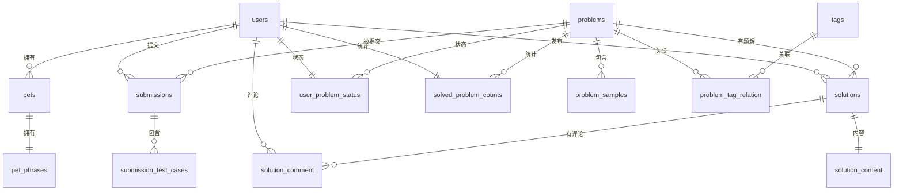
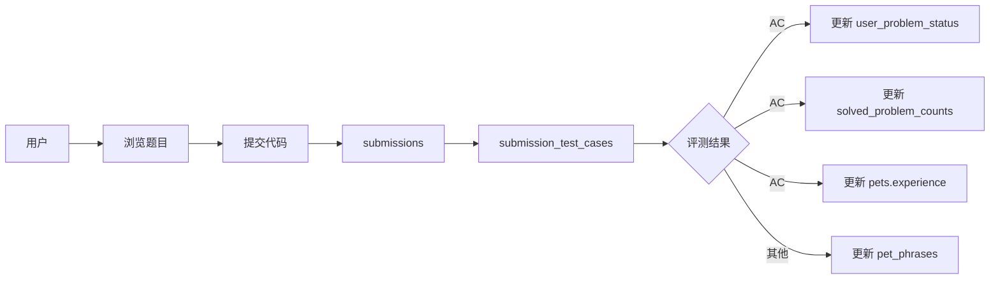
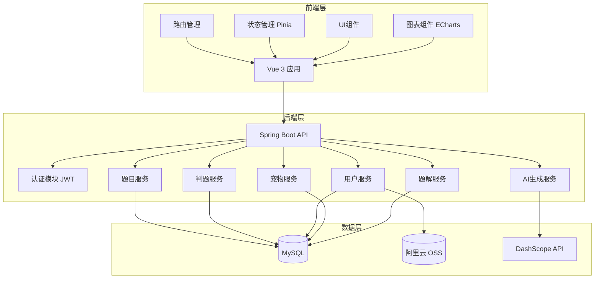
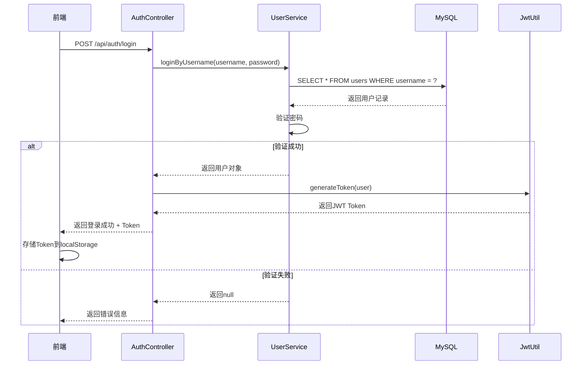
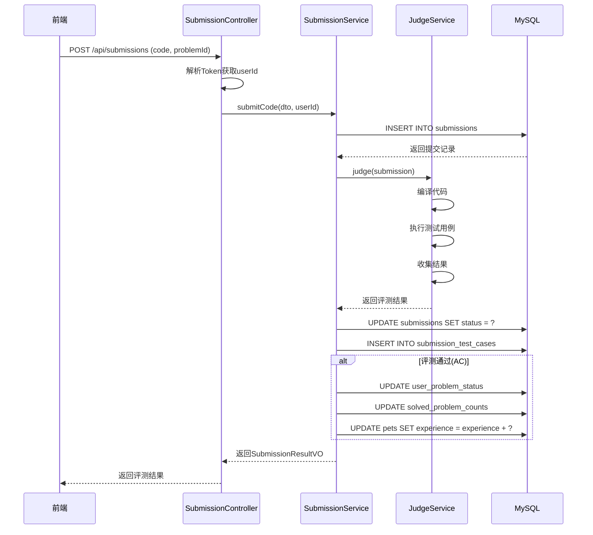

# CLT_OJ_System

CLT_OJ_System 是一个基于 Spring Boot 的在线判题系统，提供代码评测、题目管理、用户认证等功能，同时集成了 AI 题目生成、虚拟宠物等特色功能。

## 目录

- [项目结构](#项目结构)
- [技术栈](#技术栈)
- [核心功能](#核心功能)
- [快速开始](#快速开始)
- [项目配置](#项目配置)
- [主要 API 端点](#主要-api-端点)
- [项目特色](#项目特色)
- [开发与贡献](#开发与贡献)
- [许可证](#许可证)
- [联系方式](#联系方式)
- [数据库设计](#数据库设计)
- [系统架构图](#系统架构图)

## 项目结构

本项目采用多模块架构，主要包含以下模块：

```
CLT_OJ_System/
├── clt-oj-system-starter/       # 主模块，核心功能实现
│   ├── src/main/java/com/clt/
│   │   ├── controller/          # REST API 控制器
│   │   ├── service/             # 业务逻辑层
│   │   ├── mapper/              # MyBatis 数据访问层
│   │   ├── entity/              # 数据库实体
│   │   ├── dto/                 # 数据传输对象
│   │   ├── vo/                  # 视图对象
│   │   ├── exception/           # 自定义异常
│   │   └── utils/               # 工具类
│   └── src/main/resources/
│       ├── mapper/              # MyBatis XML 映射文件
│       └── application.yml      # 应用配置
├── ai-qianwen-generator-module/  # AI题目生成模块
├── virtual-pet-module/           # 虚拟宠物模块
├── solution-section-module/      # 题解模块
├── echarts/                      # 图表统计模块
├── utils/                        # 工具类模块
└── pom.xml                       # 项目依赖管理
```

## 技术栈

- **后端**：Spring Boot 3.5.12, Java 17, MyBatis, MySQL
- **认证**：JWT (JSON Web Token)
- **存储**：阿里云 OSS (用于头像存储)
- **AI 服务**：DashScope API
- **前端**：Vue 3, Vite, TailwindCSS 3, ECharts

## 核心功能

### 1. 题目管理

- 题目创建、编辑、删除（管理员权限）
- 分页查询题目列表
- 题目详情查看
- 题目标签管理
- 题目搜索（模糊匹配）
- 题目筛选（按难度）
- AI 智能题目生成

### 2. 代码评测

- 支持多种编程语言提交
- 实时评测结果反馈
- 提交历史记录查询
- 测试用例结果详情

### 3. 用户系统

- 用户注册、登录、注销
- 个人信息管理（昵称、爱好、简介、头像）
- 用户排名系统
- 用户删除

### 4. AI 题目生成

- 基于 DashScope API 自动生成编程题目
- 智能题目推荐（6道推荐题目）

### 5. 虚拟宠物系统

- 宠物状态管理
- 宠物经验值更新
- 每日打卡功能
- 宠物短语配置

### 6. 题解系统

- 题解发布、编辑、删除
- 评论功能
- 题解列表查询

### 7. 数据可视化

- 用户活跃度热力图
- 能力雷达图

## 快速开始

### 环境要求

- JDK 17 或更高版本
- Maven 3.6+ 或更高版本
- MySQL 8.0 或更高版本
- Node.js 18+（前端）

### 数据库配置

1. 创建数据库 `clt_oj_database`
2. 配置 `clt-oj-system-starter/src/main/resources/application.yml` 中的数据库连接信息

### 构建与运行

1. 克隆项目

```bash
git clone <项目地址>
cd CLT_OJ_System
```

1. 构建项目

```bash
mvn clean install
```

1. 运行主模块

```bash
cd clt-oj-system-starter
mvn spring-boot:run
```

### 前端运行

```bash
cd front_end
npm install
npm run dev
```

## 项目配置

### 核心配置文件

- `clt-oj-system-starter/src/main/resources/application.yml`：主模块配置
    - 数据库连接信息（由自己提供）
    - JWT 密钥配置
    - 阿里云 OSS 配置（由自己提供）
    - DashScope API 配置（由自己提供）

### 环境变量
- `DASHSCOPE_API_KEY`：DashScope API 密钥，用于 AI 题目生成功能
- `OSS_ACCESS_KEY_ID`：阿里云 OSS 访问密钥 ID
- `OSS_ACCESS_KEY_SECRET`：阿里云 OSS 访问密钥 Secret

### 配置说明
1. **阿里云 OSS 配置**：
    - 需要创建一个 OSS bucket 容器
    - 在主模块配置文件 `clt-oj-system-starter/src/main/resources/application.yml` 中配置 `aliyun.oss` 相关参数
    - 将 `OSS_ACCESS_KEY_ID` 和 `OSS_ACCESS_KEY_SECRET` 设置为环境变量

2. **DashScope API 配置**：
    - 将 `DASHSCOPE_API_KEY` 设置为环境变量，用于 AI 题目生成功能

## 主要 API 端点

### 认证相关

| 方法 | 端点 | 描述 | 需要认证 |
| :--- | :--- | :--- | :--- |
| `POST` | `/api/auth/register` | 用户注册 | 否 |
| `POST` | `/api/auth/login` | 用户登录 | 否 |
| `PUT` | `/api/auth/change` | 修改密码 | 否 |
| `POST` | `/api/auth/logout` | 用户注销 | 是 |

### 题目相关

| 方法 | 端点 | 描述 | 需要认证 |
| :--- | :--- | :--- | :--- |
| `GET` | `/api/problems/page` | 分页查询题目列表 | 否 |
| `GET` | `/api/problems/{id}` | 获取题目详情 | 否 |
| `GET` | `/api/problems/search` | 搜索题目（模糊匹配） | 否 |
| `GET` | `/api/problems/filter` | 按难度筛选题目 | 否 |
| `GET` | `/api/problems/recommend` | 获取推荐题目（6道） | 否 |
| `POST` | `/api/admin/problems` | 创建题目 | 管理员 |
| `PUT` | `/api/admin/problems` | 更新题目 | 管理员 |
| `DELETE` | `/api/admin/problems/{id}` | 删除题目 | 管理员 |

### 提交相关

| 方法 | 端点 | 描述 | 需要认证 |
| :--- | :--- | :--- | :--- |
| `POST` | `/api/submissions` | 提交代码 | 是 |
| `GET` | `/api/submissions` | 获取所有提交记录 | 否 |
| `GET` | `/api/submissions/{id}` | 获取提交详情 | 否 |
| `GET` | `/api/submissions/problem/{problemId}` | 获取题目提交记录 | 是 |
| `GET` | `/api/submissions/user/{userId}` | 获取用户提交记录 | 否 |

### 用户相关

| 方法 | 端点 | 描述 | 需要认证 |
| :--- | :--- | :--- | :--- |
| `GET` | `/api/users` | 获取所有用户列表 | 否 |
| `GET` | `/api/users/{id}` | 获取指定用户信息 | 否 |
| `GET` | `/api/users/me` | 获取当前用户信息 | 是 |
| `PUT` | `/api/users` | 更新用户信息 | 是 |
| `POST` | `/api/users/upload` | 上传用户头像 | 是 |
| `DELETE` | `/api/users` | 删除当前用户 | 是 |
| `GET` | `/api/users/rank` | 获取用户排名 | 否 |

### AI 题目生成

| 方法 | 端点 | 描述 | 需要认证 |
| :--- | :--- | :--- | :--- |
| `GET` | `/api/admin/ai` | 生成 AI 题目 | 管理员 |

### 虚拟宠物

| 方法 | 端点 | 描述 | 需要认证 |
| :--- | :--- | :--- | :--- |
| `GET` | `/api/pets/{userId}` | 获取用户宠物信息 | 是 |
| `POST` | `/api/pets/punch` | 宠物打卡 | 是 |
| `PUT` | `/api/pets/{userId}` | 更新宠物信息 | 是 |

### 题解相关

| 方法 | 端点 | 描述 | 需要认证 |
| :--- | :--- | :--- | :--- |
| `GET` | `/api/solutions` | 获取题解列表 | 否 |
| `POST` | `/api/solutions` | 发布题解 | 是 |
| `GET` | `/api/solutions/{id}` | 获取题解详情 | 否 |
| `POST` | `/api/solutions/{id}/comments` | 发表评论 | 是 |

## 项目特色

1. **模块化设计**：采用多模块架构，各功能模块解耦合，便于维护和扩展
2. **AI 集成**：利用 DashScope API 实现智能题目生成
3. **虚拟宠物**：增加用户粘性的趣味功能，通过答题获得经验值
4. **完整的判题系统**：支持多种编程语言的代码评测
5. **响应式前端**：基于 Vue 3 构建的现代化前端界面，支持深色/浅色主题
6. **数据可视化**：集成 ECharts 实现用户活跃度热力图和能力雷达图

## 开发与贡献

1. Fork 本项目
2. 创建特性分支 (`git checkout -b feature/AmazingFeature`)
3. 提交更改 (`git commit -m 'Add some AmazingFeature'`)
4. 推送到分支 (`git push origin feature/AmazingFeature`)
5. 打开 Pull Request

## 许可证

本项目采用 MIT 许可证 - 详情见 [LICENSE](LICENSE) 文件

## 联系方式

如有问题或建议，请联系项目维护者。

## 数据库设计

### 数据库概览

`clt_oj_database` 是一个在线判题系统（Online Judge）的数据库，包含以下 14 张表：

| 序号 | 表名 | 说明 |
| :--- | :--- | :--- |
| 1 | `users` | 用户信息表 |
| 2 | `pets` | 用户宠物表 |
| 3 | `pet_phrases` | 宠物短语表 |
| 4 | `problems` | 题目表 |
| 5 | `tags` | 标签表 |
| 6 | `problem_tag_relation` | 题目标签关联表 |
| 7 | `problem_samples` | 题目样例表 |
| 8 | `submissions` | 提交记录表 |
| 9 | `submission_test_cases` | 提交测试用例表 |
| 10 | `user_problem_status` | 用户题目状态表 |
| 11 | `solved_problem_counts` | 已解决题目统计表 |
| 12 | `solutions` | 题解表 |
| 13 | `solution_comment` | 题解评论表 |
| 14 | `solution_content` | 题解内容表 |

### 表结构详情

#### users（用户信息表）

| 字段名 | 类型 | 可空 | 主键 | 默认值 | 说明 |
| :--- | :--- | :--- | :--- | :--- | :--- |
| `id` | bigint | NO | PRI | - | 用户ID，自增 |
| `username` | varchar(50) | NO | UNI | - | 用户名 |
| `password` | varchar(255) | NO | - | - | 密码（加密存储） |
| `role` | tinyint | YES | - | 1 | 用户角色（1-普通用户，0-管理员） |
| `created_at` | datetime | YES | - | CURRENT_TIMESTAMP | 创建时间 |
| `nickname` | varchar(50) | YES | - | - | 昵称 |
| `hobby` | varchar(255) | YES | - | - | 爱好 |
| `introduction` | varchar(255) | YES | - | - | 个人简介 |
| `avatar` | varchar(255) | YES | - | 默认头像URL | 头像地址 |
| `punch_count` | int | YES | - | 0 | 打卡次数 |
| `last_punch_time` | datetime | YES | - | - | 最后打卡时间 |

#### pets（用户宠物表）

| 字段名 | 类型 | 可空 | 主键 | 默认值 | 说明 |
| :--- | :--- | :--- | :--- | :--- | :--- |
| `id` | bigint | NO | PRI | - | 宠物ID，自增 |
| `name` | varchar(50) | YES | - | - | 宠物名称 |
| `experience` | bigint | YES | - | 0 | 经验值 |
| `level` | int | YES | - | 1 | 等级 |
| `created_at` | datetime | YES | - | CURRENT_TIMESTAMP | 创建时间 |
| `punch_date` | datetime | YES | - | - | 打卡日期 |
| `number_of_punch_outs` | int | YES | - | 0 | 打卡次数 |
| `user_id` | bigint | YES | UNI | - | 所属用户ID |

#### problems（题目表）

| 字段名 | 类型 | 可空 | 主键 | 默认值 | 说明 |
| :--- | :--- | :--- | :--- | :--- | :--- |
| `id` | bigint | NO | PRI | - | 题目ID，自增 |
| `title` | varchar(200) | NO | - | - | 题目标题 |
| `description` | text | NO | - | - | 题目描述 |
| `input_format` | text | YES | - | - | 输入格式 |
| `output_format` | text | YES | - | - | 输出格式 |
| `time_limit` | decimal(8,3) | YES | - | 10.000 | 时间限制（秒） |
| `memory_limit` | decimal(10,2) | YES | - | 256.00 | 内存限制（MB） |
| `difficulty` | tinyint | YES | - | 1 | 难度（1-简单，2-中等，3-困难） |
| `hint` | text | YES | - | - | 提示信息 |

#### submissions（提交记录表）

| 字段名 | 类型 | 可空 | 主键 | 默认值 | 说明 |
| :--- | :--- | :--- | :--- | :--- | :--- |
| `id` | bigint | NO | PRI | - | 提交ID，自增 |
| `user_id` | bigint | NO | MUL | - | 提交用户ID |
| `problem_id` | bigint | NO | MUL | - | 提交题目ID |
| `language` | varchar(20) | NO | - | - | 使用语言 |
| `code` | text | NO | - | - | 提交代码 |
| `status` | varchar(20) | YES | - | - | 提交状态 |
| `message` | text | YES | - | - | 状态消息 |
| `stdout` | text | YES | - | - | 标准输出 |
| `stderr` | text | YES | - | - | 标准错误 |
| `compile_output` | text | YES | - | - | 编译输出 |
| `submit_time` | datetime | YES | - | CURRENT_TIMESTAMP | 提交时间 |
| `runtime` | decimal(8,3) | YES | - | - | 运行时间（秒） |
| `memory` | decimal(10,2) | YES | - | - | 内存使用（MB） |

#### solutions（题解表）

| 字段名 | 类型 | 可空 | 主键 | 默认值 | 说明 |
| :--- | :--- | :--- | :--- | :--- | :--- |
| `id` | bigint | NO | PRI | - | 题解ID，自增 |
| `problem_id` | bigint | NO | MUL | - | 所属题目ID |
| `user_id` | bigint | NO | MUL | - | 发布用户ID |
| `title` | varchar(200) | NO | - | - | 题解标题 |
| `language` | varchar(20) | NO | - | - | 代码语言 |
| `like_count` | int unsigned | YES | - | 0 | 点赞数 |
| `comment_count` | int unsigned | YES | - | 0 | 评论数 |
| `is_official` | tinyint | NO | - | 0 | 是否官方题解（0-否，1-是） |
| `create_time` | datetime | NO | - | CURRENT_TIMESTAMP | 创建时间 |
| `update_time` | datetime | NO | - | CURRENT_TIMESTAMP | 更新时间 |

### 外键关系汇总

| 表名 | 外键字段 | 关联表 | 关联字段 |
| :--- | :--- | :--- | :--- |
| `pets` | `user_id` | `users` | `id` |
| `pet_phrases` | `pet_id` | `pets` | `id` |
| `problem_samples` | `problem_id` | `problems` | `id` |
| `problem_tag_relation` | `problem_id` | `problems` | `id` |
| `problem_tag_relation` | `tag_id` | `tags` | `id` |
| `submissions` | `user_id` | `users` | `id` |
| `submissions` | `problem_id` | `problems` | `id` |
| `submission_test_cases` | `submission_id` | `submissions` | `id` |
| `user_problem_status` | `user_id` | `users` | `id` |
| `user_problem_status` | `problem_id` | `problems` | `id` |
| `solved_problem_counts` | `user_id` | `users` | `id` |
| `solutions` | `problem_id` | `problems` | `id` |
| `solutions` | `user_id` | `users` | `id` |
| `solution_comment` | `solution_id` | `solutions` | `id` |
| `solution_comment` | `user_id` | `users` | `id` |
| `solution_content` | `solution_id` | `solutions` | `id` |

## 系统架构图

### 表间关系图



### 核心业务流程图



### 系统架构图



### 用户登录时序图



### 代码提交判题时序图



***

*注：本项目为学习和教学目的开发，可根据实际需求进行定制和扩展。*